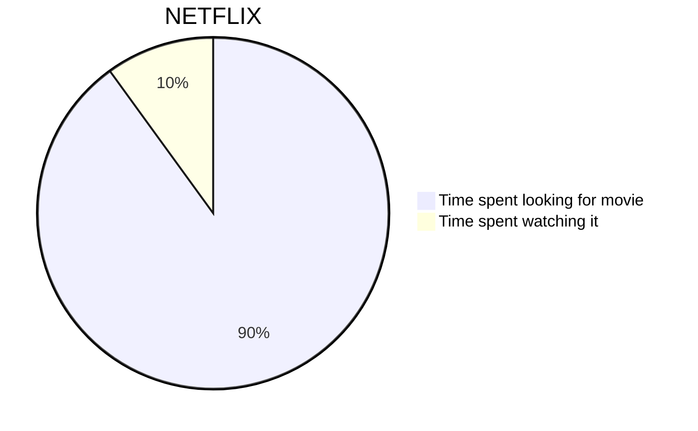

## A DeFi system
What if  I can design on-chain system that will automatically route and split the revenue among all the participants/contributors/employees according to a set formula that changes with time? Just like a vault mints share tokens for new deposits, the revenue will be split among the employees.

That's a very interesting idea to explore and perhaps a great showcase project to work on!

## A cafe example
The revenue will be all the sales made in the past week. However, we will need to subtract operational cost and do other accounting prior to distributing.

$$
a^2 + b^2 = c^2
$$
