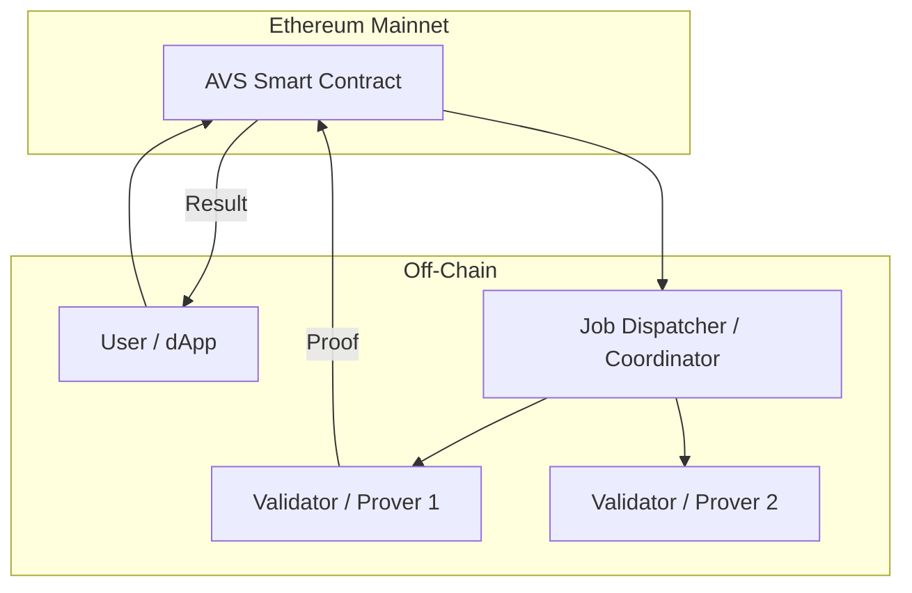
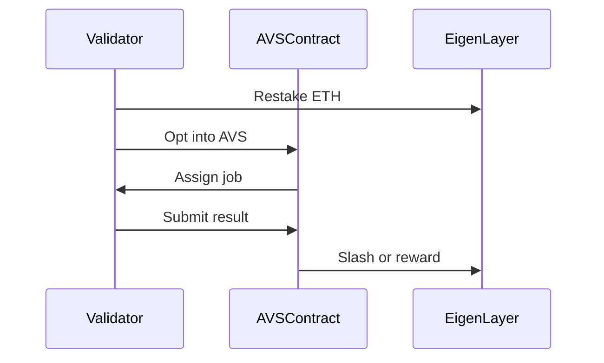
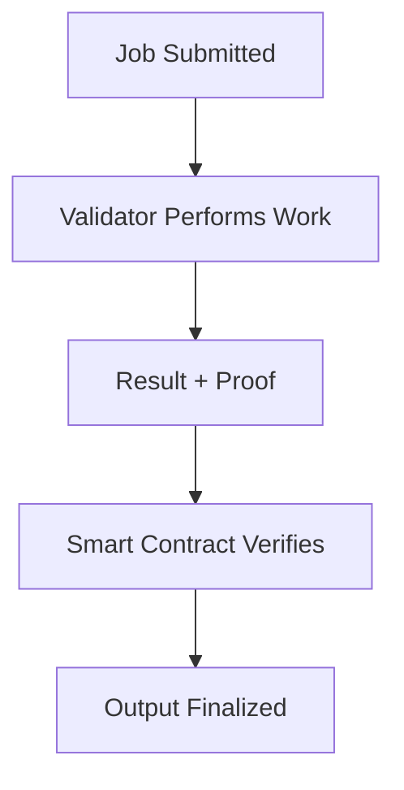

## Key Takeaways
* **EigenLayer enables ETH restaking** – Ethereum stakers can opt in to validate new modules by accepting additional slashing conditions.
* **Extends Ethereum security** – Restakers lend Ethereum’s economic security to external modules like oracles, bridges, VMs, and DA layers.
* **Security aggregation** – Instead of fragmenting trust, EigenLayer unifies ETH security across multiple services.
* **New earning opportunities** – Restakers can earn fees from participating in various validation tasks beyond Ethereum's consensus.
* **Innovation sandbox** – EigenLayer acts as a testing ground for Ethereum upgrades (e.g., Danksharding), allowing experimentation before core integration.
* **Enables permissionless innovation** – Developers can deploy new trust-based systems without building their own validator networks.

## Launching a New AVS Secured by EigenLayer

As blockchain infrastructure matures, the paradigm of decentralized trust is evolving beyond consensus and into coordination. **EigenLayer**, an Ethereum restaking protocol, introduces a novel primitive—**Actively Validated Services (AVSs)**—which allows developers to build off-chain services that inherit Ethereum-grade security without modifying Ethereum itself.

This opens a new frontier where services like oracles, data availability layers, zero-knowledge provers, and bridging protocols can be **decentralized, economically secure, and composable**.

## 🔧 Designing the Service

The first step in launching an AVS is defining the **core work** your validator set will perform. For example:

- Generating ZK proofs
- Aggregating off-chain data
- Validating cross-chain messages
- Providing data availability for L2s

The work must be:

- ✅ **Verifiable**
- 🔁 **Repeatable**
- 🔌 **Composable**

### AVS Architecture (Conceptual)




### 🛡️ Building the Validator Set

Thanks to EigenLayer, you don’t have to bootstrap your own validator network. Instead, you tap into Ethereum’s validators who have restaked ETH and opted in to your AVS.
Validator Roles

Validators can be assigned one or more responsibilities:

* ✍️ Provers: Generate ZKPs or other proofs
* 📜 Attesters: Sign or validate submitted results
* 🔍 Disputers: Challenge incorrect proofs




### 🧱 Smart Contract Architecture

You’ll typically write a set of contracts that:

* Handle job submissions from users
* Track validator opt-ins
* Distribute rewards and enforce slashing
* Coordinate with EigenLayer's AVS registry
* Example: Minimal Job Submission Contract (Solidity)

```solidity
// SPDX-License-Identifier: MIT
pragma solidity ^0.8.20;

interface IAVSValidator {
    function submitProof(uint jobId, bytes calldata proof) external;
}

contract JobSubmission {
    address public owner;
    uint public jobCounter;

    struct Job {
        address submitter;
        string inputData;
        bool fulfilled;
    }

    mapping(uint => Job) public jobs;

    constructor() {
        owner = msg.sender;
    }

    function submitJob(string calldata inputData) external returns (uint) {
        jobCounter++;
        jobs[jobCounter] = Job(msg.sender, inputData, false);
        return jobCounter;
    }

    function markFulfilled(uint jobId) external {
        require(msg.sender == owner, "Only coordinator can fulfill");
        jobs[jobId].fulfilled = true;
    }
}
```

### 🚀 Bootstrapping the Network

At launch, your primary goals are to:
* Attract validators to opt in
* Onboard developers to submit jobs
* Demonstrate provable correctness

Strategies include:
* Starting with a whitelisted validator set
* Running a testnet with rewards
* Publishing clear SDKs & APIs for integration

### ✅ Security and Verification

Your AVS must be verifiable—anyone should be able to check validator output. This often involves:
* Zero-Knowledge Proofs
* Merkle inclusion proofs
* Signature threshold schemes

If results can't be easily verified, your AVS must include dispute resolution mechanisms or watchdogs.
High-Level Verification Pipeline



### 🧠 Conclusion: Ethereum-Secured Utility Layers

Launching an AVS on EigenLayer is about composing trust into new domains. By tapping into Ethereum’s economic security, developers can create powerful off-chain services without spinning up siloed validator sets.

As the AVS ecosystem matures, we’ll see a proliferation of services that mirror Ethereum’s openness and trust—but go far beyond what consensus alone can secure.

> If Ethereum was the world’s computer, AVSs are its distributed toolkit.
