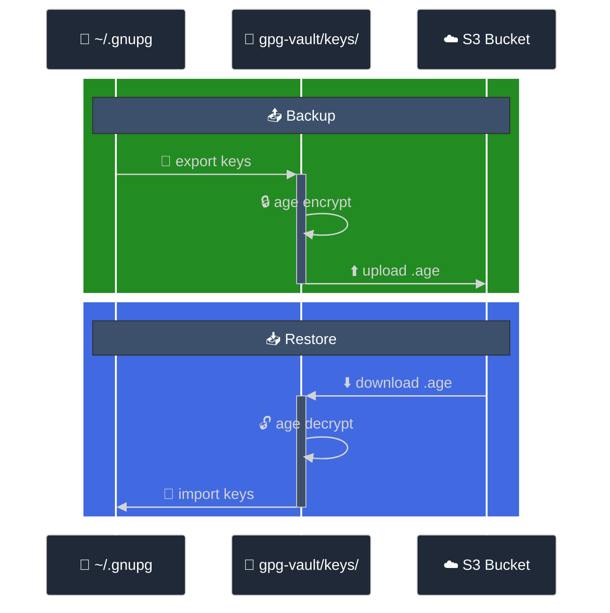

# How I derive my peace of mind from double encryption

Last week I had a moment of clarity: my GPG keys were living on a single drive. One bad day away from losing access to everything. I needed backups, but I also wanted them secure enough that I could throw them anywhere without losing sleep.

## The Setup

I use gnupass for password management – it's basically a GPG-encrypted folder structure that plays nice with the terminal. No cloud sync, no monthly fees, just encrypted files on disk. The catch? If you lose your GPG keys, you lose everything.

So I needed backups that were:

1. Stored off-site (because house fires exist)
2. Encrypted beyond my already-encrypted keys (because paranoia)
3. Simple to restore (because panic makes you stupid)

## The Solution

Double encryption: GPG keys → age encryption → S3. Yeah, it's overkill, but it works.

Here's the flow:



## How It Actually Works

```mermaid
graph TB
    subgraph "My Local Machine"
        A[gnupass passwords] -->|protected by| B[GPG Private Keys]
        B -->|armored export| C[ASCII-armored keys]
    end

    subgraph "First Encryption Layer"
        C -->|age encryption| D[age-encrypted blob]
        E[age passphrase] -.->|protects| D
    end

    subgraph "Cloud Storage"
        D -->|aws s3 cp| F[S3 Bucket]
        F -->|HTTPS + S3 encryption| G[Double-encrypted at rest]
    end

    style A fill:#2d3748
    style B fill:#4a5568
    style D fill:#22543d
    style F fill:#1e3a8a
    style G fill:#7c3aed
```



Two layers of encryption:

1. **GPG keys themselves** - Already passphrase-protected
2. **Age encryption** - Modern, simple, no legacy cruft. I wrap the exported keys with age before they leave my machine

(Plus S3 adds its own encryption at rest, but that's just a bonus)

Is it necessary? No. Does it help me sleep? Absolutely.

## The Commands

I used `just` for the automation:

```bash
# Backup
just gpg-export      # Export GPG keys
just encrypt         # Age encrypt them
just drop-in-bucket  # Upload to S3

# Restore
just decrypt         # Decrypt with age
just gpg-import      # Import to GPG
```

Six commands total. Simple enough that I won't mess it up when I actually need it.

## Why This Approach?

I like gnupass + GPG because there's no middleman. No accounts, no subscriptions, no privacy policy updates. Just encrypted files I control.

The double encryption means I can store backups anywhere – S3, Dropbox, a USB stick at my parents' house – without worrying about who might find them. Even if AWS gets breached (unlikely) or someone gets my S3 credentials (less unlikely), they're still looking at age-encrypted data protecting GPG-encrypted keys.

## The Catch

Forget your age passphrase? Backups are gone.  
Forget your GPG passphrase? Everything is gone.  
No recovery emails, no security questions. Just you and your memory.

## Code

The whole setup is on GitHub: [mcmoodoo/gpg-vault](https://github.com/mcmoodoo/gpg-vault)

You'll need:

- GPG
- age
- just
- AWS CLI
- A healthy distrust of single points of failure

## Final Thoughts

Is double-encrypting GPG keys overkill? Yes.  
Did I spend a weekend on this? Also yes.  
Do I regret it? Not even a little.

There's something satisfying about owning your own security, even if it means going overboard. In a world of data breaches and leaked credentials, sometimes paranoia is just good hygiene.

---

\_P.S. - For those living in the quantum era: when you crack my double-encrypted keys, please don't liquidate my ETH exposure on Euler, Morpho and AAVE :)
