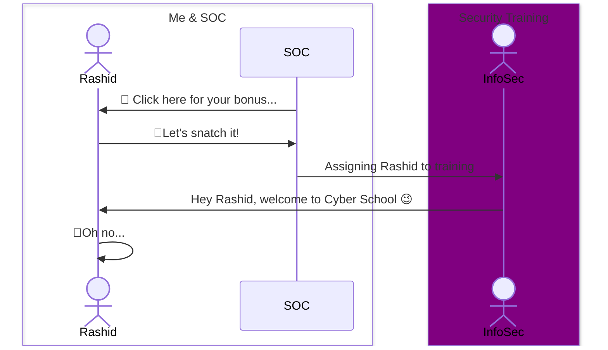
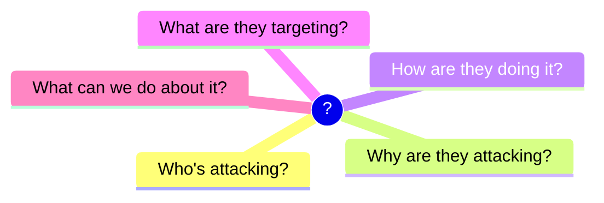
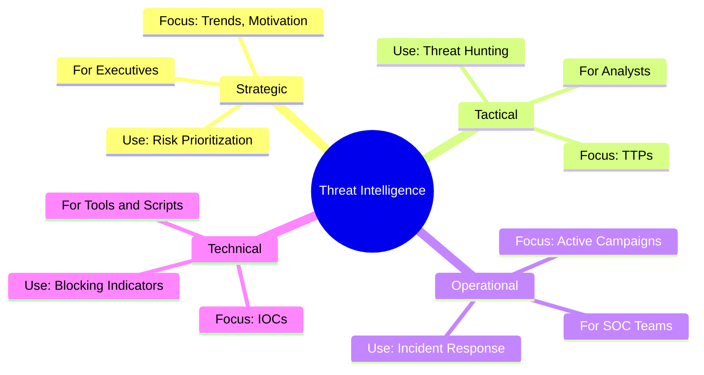
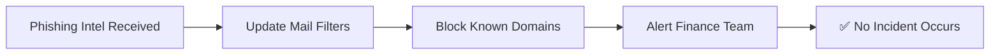

*Making sense of cyber chaos, one insight at a time.*

---

## 🚨 Introduction

Back at my previous job—a cybersecurity company that really took security seriously—I got phished at least twice a week. Not by real attackers, thankfully, but by our own security team. “Urgent invoice,” “CEO needs a favor,” “Click here for your bonus!”... It became a game of spotting the red flags, but I embraced it. Because the threats out there? They’re no joke. Breaches, ransomware crews, zero-days—you name it. It’s nonstop.



Attackers are only getting smarter, and if we’re just reacting, we’re already too late.

That’s why threat intelligence matters. It’s not just some industry buzzword—it’s how security teams actually get ahead of the curve. It’s the difference between scrambling after an incident and spotting it before it hits.

But what even is threat intelligence? And why should anyone who isn’t sitting in a government SOC or giant enterprise care?

Let’s break it down.

---

## 🧠 What Is Threat Intelligence?

**Threat intelligence** is actionable insight into cyber threats. It helps organizations understand:



Think of it like weather forecasting—but for cyberattacks. You don’t just want to know it *might* rain; you want to know when, where, and how heavy the storm will be so you can prepare accordingly.

Importantly, threat intelligence is not just raw data like a list of suspicious IPs. It’s the **narrative and insight** that connects those dots into **actionable knowledge**.

---

## 🧩 Types of Threat Intelligence

Threat intel isn’t one-size-fits-all. It comes in **four main categories**, each designed for a different audience and purpose.



---

## 🎯 Why Threat Intelligence Matters

Without intel, you’re flying blind.

With it? You can:

- 🛡️ Block attacks before they land
- ⏱️ Shorten incident response time
- 🧠 Make smarter security decisions
- 🎯 Understand your adversary’s playbook

### ✅ Example: Preempting a Phishing Campaign

Presume a list of the following known phishing domains available at [TODO: Upload to the s3 bucket and paste a link here]:
```
zoom-login-security[.]com
secure-zoom-auth[.]net
zoom-us-verification[.]org
zoom-update-confirm[.]info
zo0m-meeting-authenticate[.]com
mail-zoom-support[.]xyz
secure.zoom-account[.]tk
zoom-account-login[.]site
zoom-webinar-security[.]club
zoom-attendee-auth[.]live
```
Let's block the malicious domains (IOCs – Indicators of Compromise):
```bash
#!/bin/bash

# Download IOC list
curl -s https://threat-feed.io/phishing-zoom-iocs.txt > /tmp/iocs.txt

# Process each line
while read -r raw_domain; do
    # Skip empty lines or comments
    [[ -z "$raw_domain" || "$raw_domain" == \#* ]] && continue

    # Replace [.] with . to de-obfuscate the domain
    domain="${raw_domain//\[\]/.}"

    # Resolve the domain to IP
    ip=$(dig +short "$domain" | grep -Eo '^[0-9]+\.[0-9]+\.[0-9]+\.[0-9]+')

    if [[ -n "$ip" ]]; then
        echo "Blocking outbound traffic to $domain ($ip)"
        sudo ufw deny out to "$ip"
    else
        echo "Could not resolve $domain"
    fi

done < /tmp/iocs.txt
```

To run the script:
```bash
chmod +x block-iocs.sh && ./block-iocs.sh
```

### Intel = time. Time = breaches avoided.



---

## 🔍 How It’s Collected & Used

Threat intelligence is collected from a variety of sources:

- Internal telemetry (SIEM logs, IDS/IPS alerts)
- External threat feeds (commercial or open-source)
- OSINT (open-source intelligence)
- Dark web monitoring
- Malware sandboxing and reverse engineering

### 🧰 Example: IOC Aggregation Script (Python)

```python
import requests

sources = [
    "https://openintel.io/feeds/iocs.txt",
    "https://threatintel.example.com/api/iocs"
]

iocs = set()
for url in sources:
    response = requests.get(url)
    iocs.update(response.text.strip().splitlines())

with open("blocklist.txt", "w") as f:
    for ioc in sorted(iocs):
        f.write(f"{ioc}
")

print(f"Collected {len(iocs)} IOCs.")
```

Once collected, intel is:

- **Analyzed** by threat analysts
- **Correlated** with existing data (logs, incidents)
- **Shared** using STIX/TAXII standards
- **Acted on** by SOC teams or automated systems

---

## ⚠️ Common Challenges

Even good threat intel faces hurdles:

- **Noise** – Too many alerts, not enough context
- **Attribution** – Hard to tell who's really behind an attack
- **Sharing friction** – Legal and privacy concerns slow collaboration
- **Skill gaps** – Not enough trained analysts

Threat intelligence is powerful—but only when filtered, focused, and understood.

---

## 🧭 Conclusion

Threat intelligence helps organizations turn chaos into clarity. Whether you're defending a Fortune 500 or a small dev shop, it gives you the foresight and context to act **before damage is done**.

It’s not just about data—it’s about understanding your adversary, anticipating their moves, and hardening your defenses accordingly.

> Threat intelligence isn't a luxury—it's table stakes.
